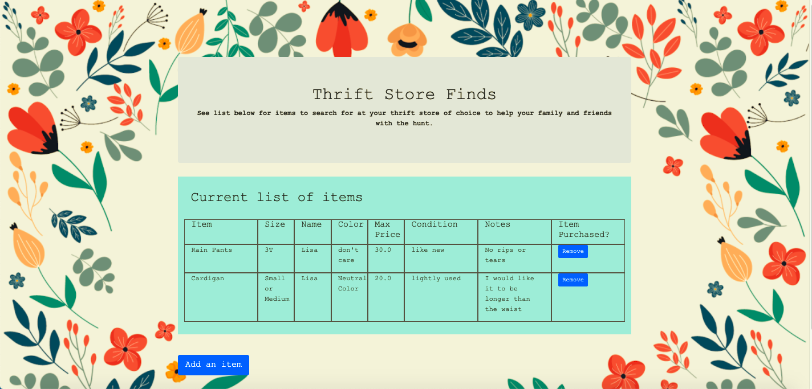

# thrift_crowdsource

## Project Background
This is a web application that allows users to team up with family and friends to help find items at thrift stores. This project uses `Python`,`JavaScript`, `HTML`, `CSS`, `Flask`, `Bootstrap`, and `SQLite`/`PostgreSQL`. 

## How to use
This application is deployed using Heroku. The URL is: https://thrift-team.herokuapp.com/. This will bring you to the main page.

