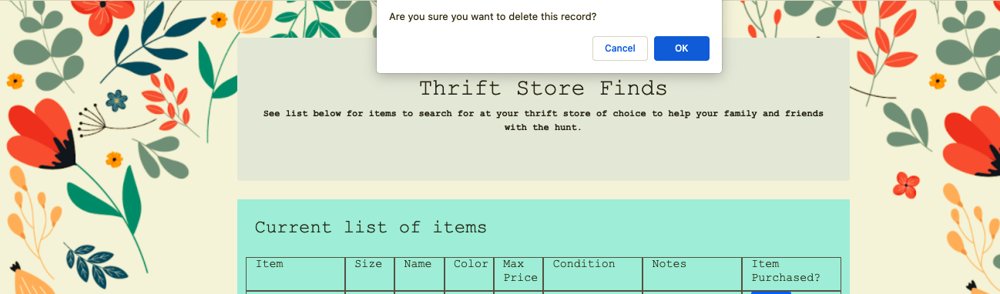
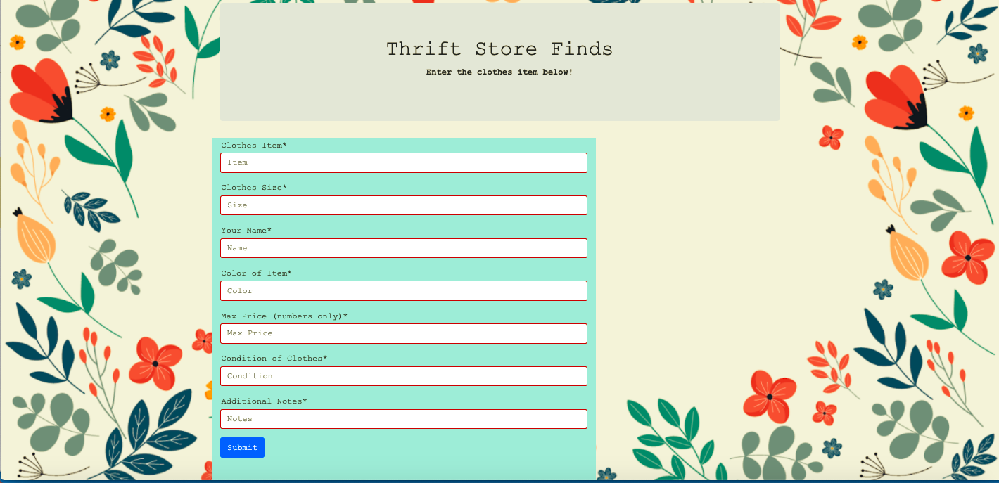
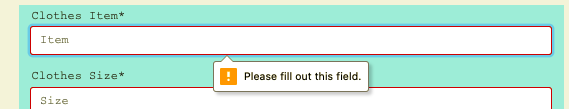

# thrift_crowdsource

## Project Background
This is a web application that allows users to team up with family and friends to help find items at thrift stores. This project uses `Python`,`JavaScript`, `HTML`, `CSS`, `Flask`, `Bootstrap`, and `SQLite`/`PostgreSQL`. 

## How to use
This application is deployed using Heroku. The URL is: https://thrift-team.herokuapp.com/. The link will bring you to the main page.

On the main page you are able to view the items that you friends and family have added to the table which you can help them search for at your thrift stores in your area. If you have found and bought an item and want to delete it from the table, press the Remove button to the right of the record. When you press the button, you will be given a confirmation prompt seen below. If you press cancel, the item will not be removed. If you press Ok, the item will be removed from the list once you refresh the page.

If you click on the "Add an item" button, this will bring you to the form page. 

On this page you will fill out the form to add an item to the table. Each item in the form needs to be filled out. If you do not fill out an item in the form, there will be an error given like the picture below. 

The field for max price will not let you put anything into the field except for a number. Once the form is submitted, it will take you back to the main page and the item will be in the table.

## Details of the Code
### Installation
In order to use this website without the Heroku deployement, you will need to install the following applications by using your termial/git and using pip install:
- `flask_sqlalchemy`
- `flask`

### Code description
#### Python - initdb.py
This sets up the initial structure of the SQL database and only needs to be run once.

#### Python - models.py
This is the class that is the structure of the SQL database and is called by the app.py function.

#### Python - app.py
The app.py python program connects to the SQL database by calling the "create_classes" function. It uses the following flask routes:

- '/' flask route queries the SQL database to pull all the records from the database, db. It compiles the records into a list. Each list item is a record set up as a dictionary. The route renders the main.html template and passes it the list variable. The main.html pages uses a for loop to go through all of the list items and places them in a bootstrap grid and creates the table on the main page. 

- The '/form' route renders the form.html template.

- The '/send' route adds and commits the record added in the form to the database

- The '/remove' route gets the JSON sent from the webpage along with the class which contains the id of the record. It uses that id to delete the record from the database.

#### JavaScript - app.js
This javascript file runs when the "remove" button is clicked on the main.html page. It sends a confirm message to the user. If the user presses "cancel", nothing will happen. If the user presses "Ok", the function will post the class of the html element that was clicked. It will send that JSON to the '/remove' route.
